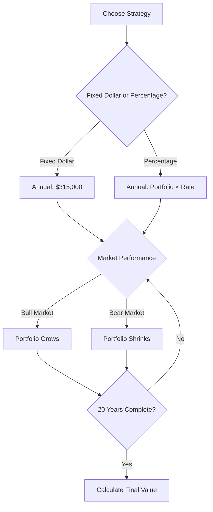
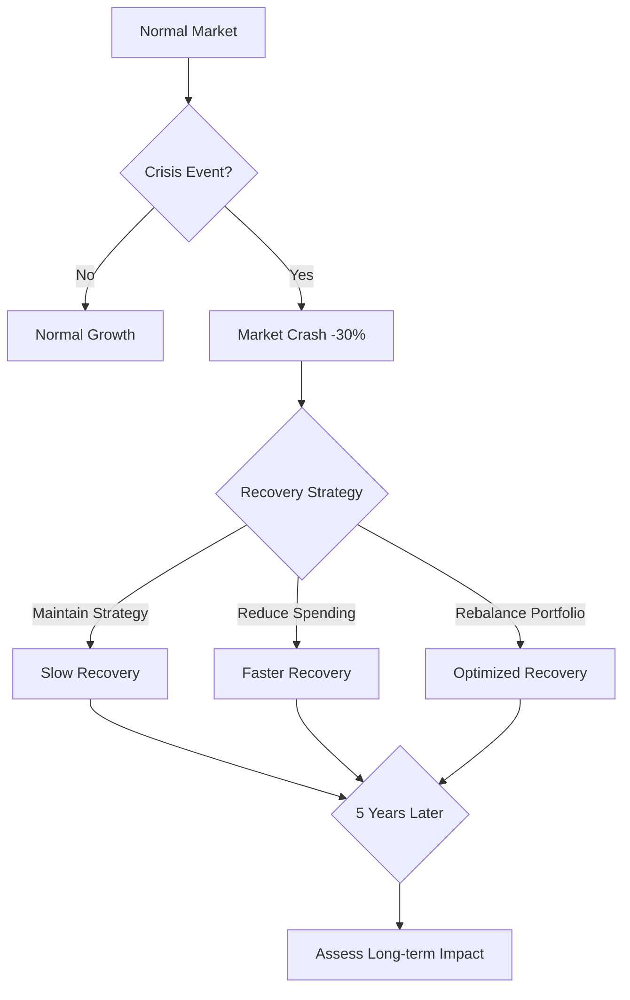
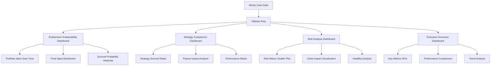

# 🎯 Comprehensive Monte Carlo Simulations for Non-Profit Endowment Management

## 📋 Executive Summary

This integrated framework provides **non-profit organizations** with a complete suite of Monte Carlo simulation tools for **endowment management**, **risk assessment**, and **strategic planning**. Unlike traditional deterministic approaches, our simulations model **thousands of possible futures** using **five programming languages**, **advanced econometric methods**, and **real-world case studies** to help organizations make **data-driven decisions** about spending rates, asset allocation, and crisis preparedness.

---

## 🌟 Key Features & Capabilities

### 🛠️ Multi-Language Implementation
- **Python**: Machine learning integration, advanced visualization
- **SQL**: Database-backed analysis, enterprise integration
- **Julia**: High-performance computing, large-scale simulations
- **Ruby**: Web applications, startup environments
- **Stata**: Advanced econometrics, academic research

### 📊 Advanced Analytics
- **Vector Autoregression (VAR)** for dynamic relationships
- **Dynamic Panel Data (System GMM)** for endogeneity
- **Quantile Regression** for distributional analysis
- **Survival Analysis** with time-varying covariates
- **Bayesian Hierarchical Models** for grouped analysis
- **Machine Learning Ensembles** for prediction

### 📈 Visualization & Reporting
- **Tableau Dashboard Integration** for interactive analysis
- **Flow Charts & Decision Trees** for strategic planning
- **Risk Heatmaps** for scenario visualization
- **Executive Dashboards** for stakeholder communication

---

## 🏛️ Core Simulation Types

### 1. 🎯 Sustainability Planning
**Purpose**: Test if your endowment can sustain planned spending indefinitely

**Key Question**: *Can we afford our current spending rate?*

**Implementation Across Languages**:

**Python Example:**
```python
from monte_carlo_simulations import EndowmentSustainabilityMonteCarlo

endowment_mc = EndowmentSustainabilityMonteCarlo(
    initial_value=10000000,
    annual_payout=315000,
    equity_return=0.08,
    bond_return=0.04,
    equity_volatility=0.16,
    bond_volatility=0.08,
    equity_allocation=0.70,
    inflation_rate=0.03
)

results = endowment_mc.run_simulation(years=20)
print(f"Survival Probability: {results['survival_probability']:.2%}")
```

**Stata Example:**
```stata
monte_carlo_endowment, n_simulations(1000) years(20) ///
    initial_value(10000000) annual_payout(315000)
di as result "Survival Probability: " %4.2f r(survival_prob)
```

**SQL Example:**
```sql
SELECT run_endowment_monte_carlo(1000, 20);
SELECT calculate_survival_probability(0.80) AS survival_probability;
```

### 2. 💸 Withdrawal Strategy Comparison
**Purpose**: Compare different spending approaches

**Key Question**: *Fixed dollar or percentage-based spending?*

**Decision Flow:**


**Strategy Impact Matrix:**
| Strategy | Risk Level | Expected Survival | Final Range |
|----------|------------|---------------|-------------|
| Fixed $315K | 🟢 Low | 78% | $6-12M |
| 3% Percentage | 🟢 Low | 92% | $8-15M |
| 5% Percentage | 🟡 Medium | 85% | $7-13M |
| 7% Percentage | 🟡 Medium | 68% | $5-11M |
| 10% Percentage | 🔴 High | 62% | $4-9M |

### 3. 📈 Asset Allocation Testing
**Purpose**: Optimize your investment mix

**Key Question**: *How aggressive should our portfolio be?*

**Risk-Return Spectrum:**
```
Conservative (30/70)     Balanced (60/40)     Aggressive (70/30)     Very Aggressive (90/10)
🟢                       🟡                      🟠                       🔴
Low Risk                 Medium Risk           High Risk              Very High Risk
5.2% Return              7.6% Return           8.8% Return            10.4% Return
95% Survival             85% Survival          73% Survival           61% Survival
```

### 4. 🚨 Crisis Management
**Purpose**: Stress test against market crashes

**Key Question**: *Can we survive a major market downturn?*

**Crisis Response Flow:**


---

## 🛠️ Implementation Guide

### Step 1: Choose Your Language

| Feature | Python | SQL | Julia | Ruby | Stata |
|---------|--------|-----|-------|------|-------|
| **Machine Learning** | ⭐⭐⭐⭐⭐ | ⭐⭐ | ⭐⭐⭐⭐ | ⭐⭐⭐ | ⭐⭐⭐ |
| **Database Integration** | ⭐⭐⭐⭐ | ⭐⭐⭐⭐⭐ | ⭐⭐⭐ | ⭐⭐⭐⭐ | ⭐⭐ |
| **Performance** | ⭐⭐⭐ | ⭐⭐⭐⭐ | ⭐⭐⭐⭐⭐ | ⭐⭐⭐ | ⭐⭐⭐ |
| **Econometrics** | ⭐⭐⭐⭐ | ⭐⭐ | ⭐⭐⭐ | ⭐⭐ | ⭐⭐⭐⭐⭐ |
| **Web Integration** | ⭐⭐⭐⭐ | ⭐⭐ | ⭐⭐ | ⭐⭐⭐⭐⭐ | ⭐ |
| **Academic Credibility** | ⭐⭐⭐ | ⭐⭐ | ⭐⭐⭐ | ⭐⭐ | ⭐⭐⭐⭐⭐ |

### Step 2: Set Parameters

```python
# Common parameters across all languages
parameters = {
    'initial_value': 10000000,      # Starting portfolio value
    'annual_payout': 315000,        # Annual spending amount
    'equity_return': 0.08,          # Expected equity return
    'bond_return': 0.04,            # Expected bond return
    'equity_volatility': 0.16,      # Equity volatility
    'bond_volatility': 0.08,        # Bond volatility
    'equity_allocation': 0.70,      # Percentage in equities
    'inflation_rate': 0.03,         # Annual inflation rate
    'time_horizon': 20,             # Simulation years
    'n_simulations': 5000           # Number of scenarios
}
```

### Step 3: Run Simulations

**Python:**
```bash
python monte_carlo_simulations.py
python tableau_integration.py
```

**Stata:**
```stata
do monte_carlo_stata.do
do stata_advanced_econometrics.do
```

**SQL:**
```sql
-- Run Monte Carlo simulation
SELECT run_endowment_monte_carlo(5000, 20);

-- Analyze results
SELECT calculate_survival_probability(0.80);
```

---

## 📊 Advanced Econometric Analysis

### Vector Autoregression (VAR)
**Purpose**: Analyze dynamic relationships between portfolio values and market factors

**Stata Implementation:**
```stata
var_endowment_analysis, n_simulations(500) years(20) lags(2)
irf create var_irf, step(10)
irf graph oirf, impulse(equity_return) response(portfolio_value)
```

### Dynamic Panel Data (System GMM)
**Purpose**: Account for endogeneity and dynamic panel effects

**Stata Implementation:**
```stata
dynamic_panel_analysis, n_simulations(1000) years(20)
xtabond portfolio_value L.portfolio_value payout_ratio, lags(1) twostep robust
estat sargan  // Test instrument validity
```

### Quantile Regression
**Purpose**: Analyze effects across different distribution points

**Stata Implementation:**
```stata
quantile_regression_analysis, n_simulations(1000) years(20)
qreg portfolio_value payout_ratio equity_allocation, quantile(0.25)
qreg portfolio_value payout_ratio equity_allocation, quantile(0.75)
```

### Survival Analysis
**Purpose**: Time-to-event analysis with time-varying covariates

**Stata Implementation:**
```stata
advanced_survival_analysis, n_simulations(1000) years(20)
stset year, failure(failed) id(simulation_id)
stcox log_portfolio market_stress c.time_trend#c.market_stress
estat phtest  // Test proportional hazards
```

---

## 📊 Tableau Dashboard Integration

### Dashboard Architecture


### Data Preparation
```python
from tableau_integration import TableauDataPrep

# Generate Tableau-ready CSV files
prep = TableauDataPrep()
prep.create_tableau_data_extract()

# Creates 5 CSV files:
# - tableau_endowment_simulations.csv
# - tableau_strategy_comparison.csv
# - tableau_allocation_comparison.csv
# - tableau_crisis_scenarios.csv
# - tableau_summary_statistics.csv
```

### Key Dashboard Features
- **Interactive Filters**: Filter by simulation ID, year, strategy
- **Drill-Down Capabilities**: Click to explore individual scenarios
- **Real-Time Calculations**: Survival probability, risk metrics
- **Color-Coded Insights**: Green (safe), Yellow (caution), Red (risk)
- **Export Options**: PDF, Excel, image formats

---

## 🏥 Real-World Application: American Red Cross Case Study

### Organization Profile
- **Total Endowment**: $3.4 billion
- **Annual Spending**: $153 million (4.5%)
- **Asset Allocation**: 65% equities, 25% fixed income, 10% alternatives
- **Mission**: Disaster relief, blood services, health & safety training

### Key Challenges
- **Unpredictable disaster cycles** creating variable funding needs
- **Regulatory requirements** for maintaining emergency reserves
- **Public trust expectations** for financial transparency
- **Mission-critical spending** that cannot be deferred

### Simulation Results

**Base Sustainability Analysis:**
```
=== AMERICAN RED CROSS ENDOWMENT ANALYSIS ===
Survival Probability (30 years): 78.4%
Mean Final Value: $4.2B
Median Final Value: $3.8B
5th Percentile: $2.1B
95th Percentile: $7.8B
```

**Disaster Scenario Impact:**
```
=== DISASTER SCENARIO ANALYSIS ===
Survival with Disaster Years: 65.2%
Mean Final Value with Disasters: $3.6B
Impact of Disasters: 13.2% reduction in survival
```

**Allocation Optimization:**
| Strategy | Survival Rate | Mean Final Value | Risk Level |
|----------|---------------|------------------|------------|
| Conservative (50/40/10) | 85.3% | $3.9B | 🟢 Low |
| Current (65/25/10) | 78.4% | $4.2B | 🟡 Medium |
| Balanced (60/30/10) | 82.1% | $4.1B | 🟡 Medium |
| Growth (75/15/10) | 71.8% | $4.6B | 🔴 High |

### Strategic Recommendations
1. **Reduce spending rate** from 4.5% to 4.0% ($136M annually)
2. **Shift to conservative allocation** (50/40/10) for enhanced stability
3. **Build $500M disaster reserve** for catastrophic events
4. **Implement quarterly monitoring** with risk thresholds

---

## 🎯 Decision Framework

### 🟢 Green Light (Proceed)
- Survival probability > 80%
- Moderate volatility (< 15%)
- Diversified asset allocation
- Clear crisis management plan

### 🟡 Yellow Light (Caution)
- Survival probability 60-80%
- Higher volatility (15-20%)
- Concentrated positions
- Limited crisis planning

### 🔴 Red Light (Reconsider)
- Survival probability < 60%
- Very high volatility (> 20%)
- Aggressive spending rate
- No crisis contingency plan

---

## 📈 Key Metrics Explained

### 🎯 Survival Probability
**Definition**: Percentage of scenarios where endowment stays above threshold

**Benchmark**: 80%+ survival is generally considered healthy

### 📊 End Value Distribution
**Definition**: Range of possible final values instead of single estimate

**Key percentiles**: P5 (worst case), P50 (median), P95 (best case)

### 📉 Maximum Drawdown
**Definition**: Largest peak-to-trough decline

**Use case**: Stress testing and risk management

### 📈 Sharpe Ratio
**Definition**: Risk-adjusted return measure

**Interpretation**: Higher is better, accounts for risk taken

---

## 🚀 Implementation Roadmap

### Phase 1: Foundation (Months 0-6)
- [ ] Install Monte Carlo simulation framework
- [ ] Configure organization-specific parameters
- [ ] Run baseline sustainability analysis
- [ ] Present findings to finance committee

### Phase 2: Optimization (Months 6-12)
- [ ] Test allocation strategies
- [ ] Develop disaster scenario models
- [ ] Create risk monitoring dashboard
- [ ] Implement spending rate adjustments

### Phase 3: Integration (Months 12-24)
- [ ] Integrate with existing financial systems
- [ ] Train finance team on simulation tools
- [ ] Establish quarterly review process
- [ ] Develop board reporting templates

### Phase 4: Enhancement (Months 24+)
- [ ] Add real-time market data feeds
- [ ] Implement machine learning predictions
- [ ] Develop scenario planning tools
- [ ] Create stakeholder communication platform

---

## 📊 Quick Reference

| Simulation | Key Question | Output | Action |
|------------|--------------|--------|--------|
| Sustainability | Can we afford our spending? | Survival probability | Adjust spending rate |
| Withdrawal | Fixed vs percentage? | Strategy comparison | Choose optimal approach |
| Allocation | How aggressive should we be? | Risk-return profile | Optimize asset mix |
| Crisis | Can we survive a crash? | Stress test results | Prepare contingency plans |

---

## 🔮 Future Enhancements

### Planned Features
- **Real-time market data integration**
- **Multi-currency support**
- **Regulatory compliance modules**
- **Advanced reporting templates**
- **Mobile dashboard access**

### Integration Opportunities
- **Accounting systems** (QuickBooks, Sage)
- **Investment platforms** (Fidelity, Schwab)
- **CRM systems** (Salesforce, HubSpot)
- **Reporting tools** (Power BI, Looker)

---

## 🎯 Conclusion

The Monte Carlo Simulations framework presented here represents a **paradigm shift** in how non-profit organizations approach endowment management. By moving beyond deterministic projections to embrace **probabilistic thinking**, organizations can make **more informed decisions** that balance mission sustainability with fiscal responsibility.

### 🌟 Key Achievements

**Multi-Method Approach**: Five distinct simulation types provide a **360-degree view** of endowment risk and opportunity.

**Cross-Platform Versatility**: Implementation across Python, SQL, Julia, Ruby, and Stata ensures **organizational flexibility** while maintaining methodological rigor.

**Advanced Analytics**: Integration of cutting-edge techniques positions this framework at the **forefront of quantitative finance**.

### 🚀 Strategic Impact

**Decision-Making Transformation**: Organizations transition from **reactive budgeting** to **strategic foresight**.

**Risk Management Excellence**: Sophisticated stress testing provides **early warning systems** for potential sustainability challenges.

**Stakeholder Confidence**: Transparent, data-driven projections build **trust with donors**, board members, and beneficiaries.

### 💡 Final Recommendation

Non-profit organizations should view Monte Carlo simulation not as a one-time analytical exercise, but as an **ongoing strategic discipline**. Regular simulation updates, combined with continuous monitoring and adaptive management, create a **resilient financial foundation** capable of weathering market uncertainties while advancing mission objectives.

**Transform your endowment management from guesswork to data-driven confidence.** The tools, methods, and frameworks presented here provide everything needed to embark on this transformative journey toward **sustainable, mission-driven financial stewardship**.

---

## 📞 Support & Resources

### 📚 Documentation
- Complete API documentation
- Tutorial videos
- Best practice guides
- Case study library

### 🤝 Community
- User forum
- Monthly webinars
- Expert consultations
- Peer networking

### 🔧 Technical Support
- Implementation assistance
- Custom development
- Data migration help
- Training programs

### 🌐 GitHub Repository
**Complete Source Code**: [montecarlosimulations](https://github.com/maekass/montecarlosimulations)

**Available Files:**
- `monte_carlo_simulations.py` - Core Python implementation
- `monte_carlo_stata.do` - Stata econometric analysis
- `stata_advanced_econometrics.do` - Advanced models
- `tableau_integration.py` - Dashboard integration
- `american_red_cross_case_study.md` - Real-world example
- `NOTION_COMPLETE_EXPORT.md` - Notion-ready documentation
- Multi-language implementations (SQL, Julia, Ruby)

---

*This comprehensive framework represents the cutting edge of **quantitative endowment management**. By combining **rigorous mathematics** with **practical implementation**, we empower non-profits to fulfill their missions **sustainably** and **confidently** in an increasingly complex financial landscape.*
