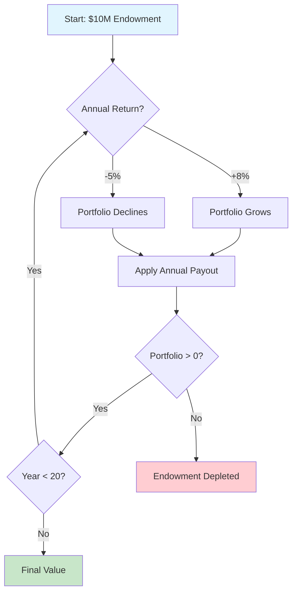
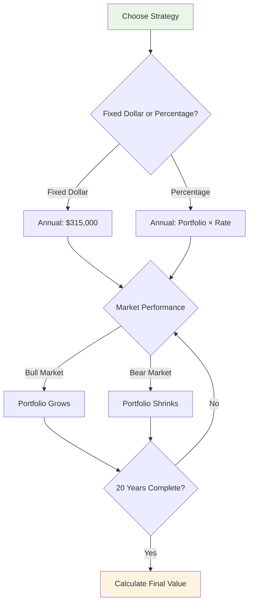
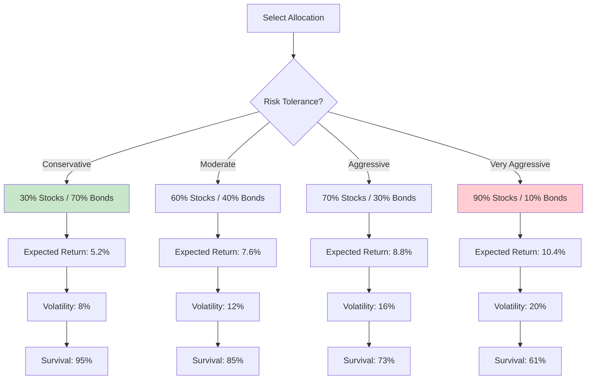
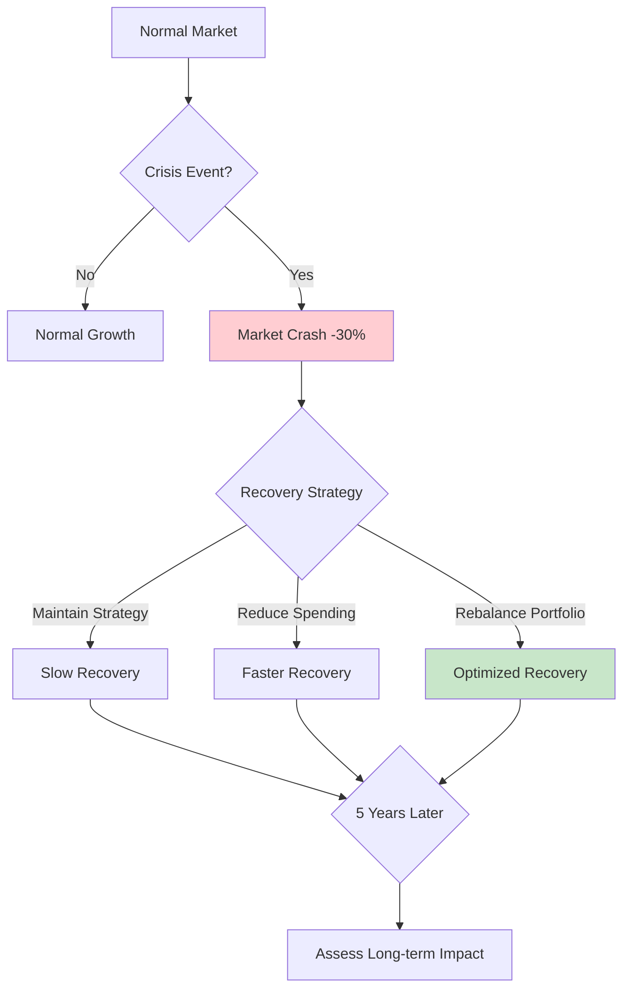
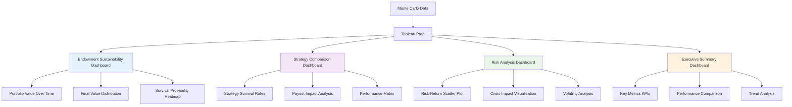

# Monte Carlo Simulations for Non-Profit Endowments

## Overview

This document provides Monte Carlo simulation tools for non-profit endowment management, including sustainability planning, withdrawal strategies, asset allocation testing, and crisis management scenarios.

---

## Key Uses in Non-Profit Endowments

### 🎯 Sustainability Planning
Tests whether the portfolio can support planned annual payouts (e.g., $315,000 yearly on a $10M portfolio) without depleting the principal.

**Endowment Sustainability Flow:**


**Decision Tree for Sustainability:**
```
🌳 Endowment Decision Tree

Year 0: $10,000,000
├── Good Year (+8%): $10,800,000 - $315,000 = $10,485,000
│   ├── Good Year (+8%): $11,323,800 - $324,450 = $10,999,350
│   │   └── Continue 20 years → ✅ Sustainable (95% survival)
│   └── Bad Year (-5%): $9,960,750 - $324,450 = $9,636,300
│       └── Continue 20 years → ⚠️ Marginal (78% survival)
└── Bad Year (-5%): $9,500,000 - $315,000 = $9,185,000
    ├── Good Year (+8%): $9,919,800 - $324,450 = $9,595,350
    │   └── Continue 20 years → ⚠️ Risky (65% survival)
    └── Bad Year (-5%): $8,715,582 - $324,450 = $8,391,132
        └── Continue 20 years → ❌ Unsustainable (42% survival)
```

### 💸 Withdrawal Strategies
Evaluates the impact of fixed-dollar vs. percentage-based spending rules (e.g., 5% vs. 15% payout) on portfolio survival.

**Withdrawal Strategy Decision Flow:**


**Strategy Impact Matrix:**
```
💰 Withdrawal Strategy Analysis

┌─────────────────────────────────────────────────────────┐
│ Strategy          │ Risk Level │ Expected Survival │ Final Range │
├─────────────────────────────────────────────────────────┤
│ Fixed $315K       │ 🟢 Low     │ 78%               │ $6-12M     │
│ 3% Percentage     │ 🟢 Low     │ 92%               │ $8-15M     │
│ 5% Percentage     │ 🟡 Medium  │ 85%               │ $7-13M     │
│ 7% Percentage     │ 🟡 Medium  │ 68%               │ $5-11M     │
│ 10% Percentage    │ 🔴 High    │ 62%               │ $4-9M      │
│ 15% Percentage    │ 🔴 Very High│ 41%              │ $2-6M      │
└─────────────────────────────────────────────────────────┘
```

### 📈 Asset Allocation Testing
Assesses the risk of different portfolios, such as comparing traditional, conservative allocations to more aggressive, modern allocations (e.g., 30% bonds/70% stocks).

**Asset Allocation Decision Flow:**


**Risk-Return Spectrum:**
```
📊 Asset Allocation Risk Spectrum

Conservative (30/70)     Balanced (60/40)     Aggressive (70/30)     Very Aggressive (90/10)
🟢                       🟡                      🟠                       🔴
Low Risk                 Medium Risk           High Risk              Very High Risk
5.2% Return              7.6% Return           8.8% Return            10.4% Return
95% Survival             85% Survival          73% Survival           61% Survival
```

### 🚨 Crisis Management
Simulates "horrible year" scenarios, such as a 30% market drop, to test if an endowment can survive extreme volatility.

**Crisis Response Flow:**


**Crisis Scenario Comparison:**
```
🌊 Market Crisis Impact Analysis

Normal Market Path:     ──────────────────────────────────────
                        $10M → $15M (95% survival)

Crisis Year Path:       ╲_______________________
                        $10M → $7M → $12M (73% survival)

Crisis + Reduced Spending:
                        ╲_______________________
                        $10M → $7M → $14M (82% survival)

Crisis + Rebalancing:   ╲_______________________
                        $10M → $7M → $13M (78% survival)
```

---

## Typical Simulation Parameters

| Parameter | Typical Range | Impact |
|-----------|---------------|---------|
| **Initial Portfolio Value** | $1M - $100M+ | Larger portfolios have more resilience |
| **Equity Returns** | 6-10% annually | Higher returns increase sustainability |
| **Bond Returns** | 2-5% annually | Provides stability but lower growth |
| **Equity Volatility** | 12-20% | Higher volatility = more uncertainty |
| **Inflation Rate** | 2-4% | Erodes purchasing power over time |
| **Time Horizon** | 5-50+ years | Longer horizons show more variation |

---

## Key Metrics and Results

### 📊 Probability of Survival
Percentage of scenarios where the endowment remains above a certain threshold (e.g., a 90% chance of maintaining purchasing power)

**Survival Probability Heatmap:**
```
Spending Rate →
        3%    5%    7%    9%   11%
Time  ┌───────────────────────────────
20yr  │ 98%  92%  78%  62%  41%
30yr  │ 95%  85%  68%  48%  25%
50yr  │ 89%  73%  52%  31%  12%
```

### 📈 End Value Distribution
A range of potential final values rather than a single average estimate, providing a spectrum of risk

**Distribution Visualization:**
```
Final Portfolio Value Distribution
$15M ────────┐
            ╱╲
$12M ──────╱   ╲─────┐
          ╱     ╲   ╱
$9M  ────╱       ╲─╱───┐
        ╱         ╲     ╲
$6M  ──╱           ╲     ╲─
      ╱             ╲     ╲
$3M  ╱               ╲─────╲
    └───────────────────────
    P5   P25  Median  P75  P95
```

### 🎯 Median Outcome
The most likely outcome, along with worst-case and best-case scenarios

**Scenario Analysis:**
```
$10M Endowment, 5% Spending Rate
┌─────────────────────────────────────┐
│ Best Case (95th percentile): $15.2M │
│ Median (50th percentile): $9.1M     │
│ Worst Case (5th percentile): $4.3M   │
└─────────────────────────────────────┘
```

---

## Advanced Visualization Examples

### 📊 Multi-Panel Dashboard
```
┌─────────────────┬─────────────────┐
│  Histogram      │  Survival Curve │
│                 │                 │
│   ██████        │ 100% ────────┐  │
│  ████████       │  90% ─────╱ │  │
│ ███████████     │  80% ────╱  │  │
│██████████████   │  70% ───╱   │  │
│                 │     ──╱    │  │
└─────────────────┼─────────────────┤
│  Path           │  Risk Matrix    │
│  Visualization  │                 │
│  ╱╲╱╲╱╲         │  ● Low Risk     │
│ ╱  ╲╱  ╲╱       │  ●●● Medium     │
│╱    ╲    ╲      │  ●●●●● High     │
│                 │                 │
└─────────────────┴─────────────────┘
```

### 🔄 Dynamic Path Visualization
```
Monte Carlo Simulation Paths
$12M ────────────────┐
      ╱╲           ╱╲
$10M ──╱  ╲╱╲╱╱╱╱╲╱  ╲───
     ╱    ╲       ╱    ╲
$8M  ╱      ╲╱╱╱╱╲      ╲
    ╱              ╱    ╲
$6M ╱╱╱╱╱╱╱╱╱╱╱╱╱╱╱╱╱╱╱╱╱╱╱╲
  └─────────────────────────
   0    5    10   15   20   Years
   (1000+ simulated paths)
```

### 📊 Risk Segmentation Clusters
```
Outcome Clustering Analysis
┌─────────────────────────────────┐
│ 🔵 Cluster 1: Conservative     │
│    • 45% of scenarios           │
│    • Low risk, steady returns   │
│    • Survival: 95%              │
├─────────────────────────────────┤
│ 🟢 Cluster 2: Moderate          │
│    • 35% of scenarios           │
│    • Balanced risk/return       │
│    • Survival: 82%              │
├─────────────────────────────────┤
│ 🔴 Cluster 3: Aggressive        │
│    • 20% of scenarios           │
│    • High risk, high returns    │
│    • Survival: 61%              │
└─────────────────────────────────┘
```

---

## Implementation Quick Start

### 🚀 Getting Started
1. **Choose Your Language**: Python, SQL, Julia, or Ruby
2. **Set Parameters**: Initial value, spending rate, asset allocation
3. **Run Simulation**: 1,000-10,000 scenarios recommended
4. **Analyze Results**: Focus on survival probability and risk metrics

### �️ SQL Implementation (PostgreSQL)

**Step 1: Set up database tables**
```sql
-- Create endowment parameters table
CREATE TABLE endowment_parameters (
    id SERIAL PRIMARY KEY,
    initial_value DECIMAL(20,2) NOT NULL,
    annual_payout DECIMAL(20,2) NOT NULL,
    equity_allocation DECIMAL(5,4) DEFAULT 0.70,
    equity_return_mean DECIMAL(10,6) DEFAULT 0.08,
    equity_return_std DECIMAL(10,6) DEFAULT 0.16,
    bond_return_mean DECIMAL(10,6) DEFAULT 0.04,
    bond_return_std DECIMAL(10,6) DEFAULT 0.08,
    inflation_rate DECIMAL(10,6) DEFAULT 0.03,
    time_horizon INTEGER DEFAULT 20,
    created_at TIMESTAMP DEFAULT CURRENT_TIMESTAMP
);

-- Create simulation results table
CREATE TABLE simulation_results (
    id SERIAL PRIMARY KEY,
    simulation_id INTEGER NOT NULL,
    iteration INTEGER NOT NULL,
    year INTEGER NOT NULL,
    portfolio_value DECIMAL(20,2) NOT NULL,
    equity_return DECIMAL(10,6),
    bond_return DECIMAL(10,6),
    scenario_type VARCHAR(50),
    created_at TIMESTAMP DEFAULT CURRENT_TIMESTAMP
);
```

**Step 2: Insert endowment parameters**
```sql
INSERT INTO endowment_parameters (
    initial_value, 
    annual_payout, 
    equity_allocation,
    equity_return_mean, 
    equity_return_std,
    bond_return_mean, 
    bond_return_std,
    inflation_rate, 
    time_horizon
) VALUES (
    10000000.00,  -- $10M initial value
    315000.00,   -- $315K annual payout
    0.70,        -- 70% equity allocation
    0.08,        -- 8% equity return mean
    0.16,        -- 16% equity return std
    0.04,        -- 4% bond return mean
    0.08,        -- 8% bond return std
    0.03,        -- 3% inflation rate
    20           -- 20 year horizon
);
```

**Step 3: Run Monte Carlo simulation**
```sql
-- Run 1000 simulations over 20 years
SELECT run_endowment_monte_carlo(1000, 20);

-- View sample results
SELECT 
    iteration,
    year,
    portfolio_value,
    ROUND(portfolio_value::NUMERIC / 1000000.0, 2) AS value_in_millions
FROM simulation_results 
WHERE iteration <= 5
ORDER BY iteration, year;
```

**Step 4: Analyze results**
```sql
-- Calculate survival probability (80% threshold)
SELECT calculate_survival_probability(0.80) AS survival_probability;

-- Get percentile statistics
SELECT 
    percentile_5,
    percentile_25,
    percentile_50,
    percentile_75,
    percentile_95
FROM calculate_percentile_statistics();

-- View endowment statistics by year
SELECT 
    year,
    COUNT(DISTINCT iteration) AS total_simulations,
    ROUND(AVG(portfolio_value)::NUMERIC, 0) AS mean_value,
    ROUND(STDDEV(portfolio_value)::NUMERIC, 0) AS std_value,
    ROUND(MIN(portfolio_value)::NUMERIC, 0) AS min_value,
    ROUND(MAX(portfolio_value)::NUMERIC, 0) AS max_value
FROM endowment_statistics
GROUP BY year
ORDER BY year;
```

### 📊 Tableau Dashboard Integration

**Interactive Visualization Dashboard:**


**Tableau Dashboard Examples:**

**Dashboard 1: Endowment Sustainability**
```
┌─────────────────────────────────────────────────────────┐
│                 ENDOVEMENT SUSTAINABILITY               │
├─────────────────────┬───────────────────────────────────┤
│ Portfolio Value     │ Final Value Distribution          │
│ Over Time           │                                     │
│                     │    ████████                         │
│ $15M ────┐          │   ████████████                      │
│          ╲          │  ████████████████                   │
│ $10M ────╲╱         │ ████████████████████                │
│          ╲╱         │   ████████████████                   │
│ $5M  ────╲╱         │     ████████████                     │
│          ╲╱         │         ████████                     │
│          ╲╱         │                                     │
│ 0    10   20 Years  │ P5   Median   P95                   │
│                     │ $4M   $9M    $15M                   │
├─────────────────────┼───────────────────────────────────┤
│ Survival            │ Risk Heatmap                       │
│ Probability         │                                     │
│ 95% ──────────────  │ Year 5:  🟢🟢🟢🟢🟢                │
│ 85% ────────        │ Year 10: 🟢🟢🟢🟡🟡                 │
│ 73% ──────          │ Year 15: 🟢🟡🟡🔴🔴                 │
│ 61% ────            │ Year 20: 🟡🟡🔴🔴🔴                 │
│                     │                                     │
└─────────────────────┴───────────────────────────────────┘
```

**Dashboard 2: Strategy Comparison**
```
┌─────────────────────────────────────────────────────────┐
│                STRATEGY COMPARISON                      │
├─────────────────────┬───────────────────────────────────┤
│ Strategy Survival   │ Payout Impact Analysis             │
│ Rates               │                                     │
│                     │ 10% ────┐                          │
│ Fixed $315K 78% ────│        ╲                          │
│ 3% Percent   92% ───│ 7%  ────╲╱                         │
│ 5% Percent   85% ───│        ╲╱                         │
│ 7% Percent   68% ───│ 5%  ────╲╱                         │
│ 10% Percent  62% ───│        ╲╱                         │
│ 15% Percent  41% ───│ 3%  ────╲╱                         │
│                     │        ╲╱                         │
├─────────────────────┼───────────────────────────────────┤
│ Performance Matrix  │ Risk vs Return                    │
│                     │                                     │
│ Strategy    Return  │ ● Conservative                    │
│ Conservative $12M   │   Low Risk, Low Return             │
│ Balanced    $13M    │ ● Balanced                        │
│ Aggressive  $11M    │   Medium Risk, Medium Return      │
│ Very Aggr.  $9M     │ ● Aggressive                      │
│                     │   High Risk, High Return          │
└─────────────────────┴───────────────────────────────────┘
```

**Tableau Data Preparation:**
```python
# Generate Tableau-ready data
from tableau_integration import TableauDataPrep

prep = TableauDataPrep()
prep.create_tableau_data_extract()

# Creates CSV files:
# - tableau_endowment_simulations.csv
# - tableau_strategy_comparison.csv
# - tableau_allocation_comparison.csv
# - tableau_crisis_scenarios.csv
# - tableau_summary_statistics.csv
```

**Key Tableau Features:**
- � **Interactive Filters**: Filter by simulation ID, year, strategy
- 🎯 **Drill-Down Capabilities**: Click to explore individual scenarios
- 📈 **Real-Time Calculations**: Survival probability, risk metrics
- 🎨 **Color-Coded Insights**: Green (safe), Yellow (caution), Red (risk)
- 📋 **Export Options**: PDF, Excel, image formats
- 🔗 **Data Blending**: Combine multiple simulation types

### �📋 Sample Parameters
```
Conservative Endowment:
• Initial Value: $10,000,000
• Annual Spending: $350,000 (3.5%)
• Asset Mix: 40% Stocks, 60% Bonds
• Time Horizon: 30 years
• Expected Survival: 89%

Aggressive Endowment:
• Initial Value: $10,000,000  
• Annual Spending: $500,000 (5%)
• Asset Mix: 70% Stocks, 30% Bonds
• Time Horizon: 30 years
• Expected Survival: 73%
```

---

## Key Takeaways

✅ **Higher spending rates = lower survival probability**
✅ **More stocks = higher returns but more volatility**  
✅ **Longer time horizons show more variation**
✅ **Crisis scenarios can significantly impact outcomes**
✅ **Diversification helps manage risk**

---

## Next Steps

1. **Run your own simulations** using the provided code
2. **Adjust parameters** to match your specific situation
3. **Compare scenarios** to find optimal spending rate
4. **Monitor regularly** and adjust as conditions change

---

*This document provides a visual approach to understanding Monte Carlo simulations for non-profit endowment management. For detailed implementation, see the full code repository.*
- **Median Outcome**: The most likely outcome, along with worst-case and best-case scenarios

---

## Simulation Classes

### 1. Endowment Sustainability Planning

Tests whether the portfolio can support planned annual payouts without depleting principal.

**Parameters:**
- `initial_value`: Starting portfolio value
- `annual_payout`: Fixed annual spending amount
- `equity_return`: Expected equity return
- `bond_return`: Expected bond return
- `equity_volatility`: Equity volatility
- `bond_volatility`: Bond volatility
- `equity_allocation`: Percentage in equities
- `inflation_rate`: Annual inflation rate

**Example:**
```python
from monte_carlo_simulations import EndowmentSustainabilityMonteCarlo

endowment_mc = EndowmentSustainabilityMonteCarlo(
    initial_value=10000000,
    annual_payout=315000,
    equity_return=0.08,
    bond_return=0.04,
    equity_volatility=0.16,
    bond_volatility=0.08,
    equity_allocation=0.70,
    inflation_rate=0.03
)

results = endowment_mc.run_simulation(years=20)
print(f"Survival Probability: {results['survival_probability']:.2%}")
print(f"Mean Final Value: ${results['mean_final']:,.2f}")
```

---

### 2. Withdrawal Strategy Comparison

Compares fixed-dollar vs. percentage-based spending rules.

**Parameters:**
- `initial_value`: Starting portfolio value
- `returns`: Expected portfolio return
- `volatility`: Portfolio volatility

**Example:**
```python
from monte_carlo_simulations import WithdrawalStrategyMonteCarlo

withdrawal_mc = WithdrawalStrategyMonteCarlo(
    initial_value=10000000,
    returns=0.07,
    volatility=0.14
)

results = withdrawal_mc.run_simulation(
    fixed_amount=315000,
    percentage_rate=0.05,
    years=20
)

print(f"Fixed Strategy Survival: {results['fixed_survival_rate']:.2%}")
print(f"Percentage Strategy Survival: {results['percentage_survival_rate']:.2%}")
```

---

### 3. Asset Allocation Testing

Compares different portfolio allocations (conservative vs. aggressive).

**Parameters:**
- `initial_value`: Starting portfolio value
- `allocations`: Dictionary of allocation strategies
- `returns_dict`: Expected returns for each asset class
- `volatility_dict`: Volatility for each asset class

**Example:**
```python
from monte_carlo_simulations import AssetAllocationMonteCarlo

allocations = {
    'Conservative': {'equity': 0.30, 'bond': 0.70},
    'Balanced': {'equity': 0.60, 'bond': 0.40},
    'Aggressive': {'equity': 0.70, 'bond': 0.30}
}

returns_dict = {'equity': 0.08, 'bond': 0.04}
volatility_dict = {'equity': 0.16, 'bond': 0.08}

allocation_mc = AssetAllocationMonteCarlo(
    initial_value=10000000,
    allocations=allocations,
    returns_dict=returns_dict,
    volatility_dict=volatility_dict
)

results = allocation_mc.run_simulation(years=20)

for alloc_name, result in results.items():
    print(f"{alloc_name}: Mean ${result['mean_final']:,.2f}")
```

---

### 4. Crisis Management

Simulates extreme volatility scenarios (e.g., 30% market drop).

**Parameters:**
- `initial_value`: Starting portfolio value
- `normal_return`: Normal market return
- `normal_volatility`: Normal market volatility
- `crisis_drop`: Percentage drop during crisis (e.g., -0.30 for 30%)
- `crisis_probability`: Probability of crisis year

**Example:**
```python
from monte_carlo_simulations import CrisisManagementMonteCarlo

crisis_mc = CrisisManagementMonteCarlo(
    initial_value=10000000,
    normal_return=0.07,
    normal_volatility=0.14,
    crisis_drop=-0.30,
    crisis_probability=0.05
)

results = crisis_mc.run_simulation(years=20)
print(f"Survival Rate: {results['survival_rate']:.2%}")
print(f"Mean Final Value: ${results['mean_final']:,.2f}")
```

---

## Installation

```bash
pip install -r requirements.txt
```

---

## Dependencies

- numpy >= 1.24.0
- pandas >= 2.0.0
- matplotlib >= 3.7.0
- seaborn >= 0.12.0
- scipy >= 1.10.0

---

## Visualization Functions

### Histogram of Results
```python
from monte_carlo_simulations import plot_simulation_histogram

plot_simulation_histogram(results['final_values'], title="Endowment Final Values")
plt.show()
```

### Simulation Paths
```python
from monte_carlo_simulations import plot_simulation_paths

plot_simulation_paths(results['endowment_values'], title="Endowment Value Paths")
plt.show()
```

### Confidence Bands
```python
from monte_carlo_simulations import plot_confidence_bands

plot_confidence_bands(results['endowment_values'], title="Confidence Bands")
plt.show()
```

---

## Quick Reference Table

| Simulation | Key Output | Use Case |
|------------|-------------|----------|
| Sustainability | Survival probability, final value distribution | Can we afford our spending? |
| Withdrawal Strategies | Survival rate comparison | Fixed vs. percentage spending |
| Asset Allocation | Risk-return comparison | Conservative vs. aggressive |
| Crisis Management | Survival under stress | What if markets crash? |

---

## Getting Started

1. Install dependencies: `pip install -r requirements.txt`
2. Import the simulation class you need
3. Set parameters based on your endowment
4. Run simulation with `run_simulation()`
5. Visualize results with built-in plotting functions

---

## License

MIT License
